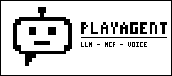

An LLM agent that runs entirely on your [Playdate](https://play.date).

- **OpenAI-compatible chat** — talks to any endpoint speaking the OpenAI
  chat completions protocol (OpenAI, OpenRouter, llama.cpp server, Ollama,
  vLLM, ...), with full tool calling support.
- **Remote MCP client** — connect [Model Context Protocol](https://modelcontextprotocol.io)
  servers over the Streamable HTTP transport. Their **tools** are exposed to
  the LLM and their **prompts** can be launched from the chat menu.
- **The agent can ask *you* questions** — a built-in `ask_user` tool lets the
  model pose a question with 2–5 options that you answer with the d-pad,
  similar to opencode's "asking".
- **Speech-to-text** — hold a conversation without typing: record with the
  Playdate microphone, transcription via a Whisper-compatible
  `/audio/transcriptions` endpoint.
- **Sessions** — create, resume and delete chat sessions; everything is
  persisted on the device.
- **Personas** — pick who the agent is (assistant, game master, retro robot,
  your own custom description) or choose **Self-determined** and let the agent
  invent its own identity at the start of every session.
- **Built-in device tools** — `device_status` gives the model access to
  battery level, local time and the crank position.
- **Remote-control opencode** — attach to an [opencode](https://opencode.ai)
  server on your LAN: watch the live transcript, send prompts (typed or
  spoken), run slash commands, check todos, abort runs and — best of all —
  **answer permission requests** (Allow once / Always / Reject) from the
  couch with the d-pad.

> Requires **Playdate OS / SDK 2.7 or newer** (the release that added the
> `playdate.network` HTTP API).

*(screenshots coming soon)*

## Installing the Playdate SDK on Linux

1. Download and unpack the SDK:

   ```sh
   cd ~
   curl -LO https://download.panic.com/playdate_sdk/Linux/PlaydateSDK-latest.tar.gz
   tar xzf PlaydateSDK-latest.tar.gz
   mv PlaydateSDK-* ~/PlaydateSDK
   ```

2. Export the SDK path (add this to your `~/.bashrc` / `~/.zshrc`):

   ```sh
   export PLAYDATE_SDK_PATH="$HOME/PlaydateSDK"
   export PATH="$PLAYDATE_SDK_PATH/bin:$PATH"
   ```

3. Install the udev rule so the Simulator and `pdutil` can talk to a real
   device over USB:

   ```sh
   sudo cp "$PLAYDATE_SDK_PATH/Resources/50-playdate.rules" /etc/udev/rules.d/
   sudo udevadm control --reload-rules && sudo udevadm trigger
   ```

4. The Simulator needs a few common libraries (Debian/Ubuntu):

   ```sh
   sudo apt install libwebkit2gtk-4.1-0 libgtk-3-0
   ```

   On Arch: `pacman -S webkit2gtk gtk3`.

## Building

```sh
make            # compiles source/ into PlayAgent.pdx with pdc
make run        # build + launch in the Playdate Simulator
make assets     # regenerate the launcher art (tools/gen_assets.py)
make provision  # serve your config to the Playdate (see below)
```

Or manually:

```sh
pdc source PlayAgent.pdx
PlaydateSimulator PlayAgent.pdx
```

> Note: networking (`playdate.network`) works in the Simulator from SDK 2.7
> on, so the whole app can be tested without hardware.

## Installing on the device

**Via the Simulator:** open `PlayAgent.pdx` in the Simulator, connect the
Playdate over USB and choose *Device → Upload Game to Device*.

**Via sideload:** zip the pdx (`zip -r PlayAgent.pdx.zip PlayAgent.pdx`),
upload it at <https://play.date/account/sideload/> and install it from
*Settings → Games* on the device.

## First-run configuration

### The easy way: import over Wi-Fi (no crank typing)

Typing an API key on the Playdate keyboard is no fun. Instead:

```sh
make provision                        # first run creates tools/playagent-config.json
$EDITOR tools/playagent-config.json   # fill in your API key, MCP servers, opencode remotes
make provision                        # prints your LAN IP + a 6-digit PIN and waits
```

Extra flags go through `ARGS`, e.g. `make provision ARGS="--forever"`.

See [`tools/playagent-config.example.json`](tools/playagent-config.example.json)
for the full format (it is also the template the first run copies).

On the Playdate: **Settings → Import config (Wi-Fi)**, type the IP shown
(e.g. `192.168.1.20`) and the 6-digit PIN. The whole configuration — API
key, model, STT, MCP servers and opencode remotes — is imported in one shot
and the server exits. The address is remembered for next time.

> The transfer is protected with HTTP Basic auth (the PIN, random on every
> run — or fix it with `--password`, disable with `--no-auth`). The payload
> still travels as plain HTTP on your LAN, so use a trusted network.
> `--forever` keeps the server running for repeated imports.

#### Running under WSL?

WSL2 sits behind a NAT network, so the Playdate can reach your Windows LAN
IP but not the WSL IP. Forward the port once (a single UAC prompt):

```sh
make wsl-forward              # forwards Windows :9393 -> WSL :9393
make wsl-forward PORT=4096    # same for opencode serve
make wsl-status               # show the current portproxy table
make wsl-unforward            # undo
```

`make provision` detects WSL automatically and prints the correct Windows
LAN IP to type on the Playdate. The WSL IP changes across Windows reboots —
just re-run `make wsl-forward` after a reboot.

An alternative on Windows 11: enable [mirrored networking](https://learn.microsoft.com/en-us/windows/wsl/networking#mirrored-mode-networking)
(`networkingMode=mirrored` in `.wslconfig`), which removes the need for
port forwarding entirely.

### Alternative: copy the file over USB (Data Disk)

The app stores its settings as `config.json` in its data folder. On the
device: **Settings → System → Reboot to Data Disk**, then copy your JSON to
`/Data/com.ray.playagent/config.json`. In the Simulator the same file lives
at `$PLAYDATE_SDK_PATH/Disk/Data/com.ray.playagent/config.json` — configure
everything comfortably in the Simulator first, then upload to the device.

### The manual way

1. Open **Settings** and set:
   - **API host** — e.g. `api.openai.com` (or your own llama.cpp/Ollama box:
     set *HTTPS off* and the right port for plain-HTTP LANs).
   - **API key** — your bearer token.
   - **Model** — e.g. `gpt-4o-mini`.
   - **STT model** — e.g. `whisper-1` (used for voice input).
2. Optionally add **MCP servers** (name, host, path, port, HTTPS). Use
   *Test connection* to verify: it runs the MCP `initialize` handshake and
   reports how many tools/prompts the server offers.
3. Pick a **Persona**, then start a **New session**.

The first network request triggers the Playdate OS permission dialog — allow
it once and you're set.

## Remote-controlling opencode

Run an opencode server on your development machine, reachable from the LAN:

```sh
OPENCODE_SERVER_PASSWORD=your-password opencode serve --hostname 0.0.0.0 --port 4096
```

> Never expose the server without a password: it can run shell commands in
> your project. Keep it on a trusted network.

On the Playdate, go to **Remote: opencode → + Add opencode server** and enter
your PC's LAN IP, the port and the password (username defaults to
`opencode`). Then **Connect**:

- **Sessions list** shows all sessions with a live `busy`/`retry` badge;
  open one or create a new session.
- **In a session** the transcript updates live (an SSE `/event` stream when
  possible — shown as `LIVE` in the status bar — with polling as fallback,
  shown as `POLL`). Tool activity is summarized as one-liners like
  `[bash] npm test`.
- Press **A** for the action menu: *Type prompt*, *Speak (mic)* (your voice
  is transcribed and sent as the prompt), *Commands* (slash commands),
  *Agent* (pick build/plan/...), *Todos*, *Abort*.
- When opencode asks for **permission** (e.g. to run a shell command), a
  dialog pops up automatically: **Allow once / Always allow / Reject**.
  Requires the `LIVE` event stream; permission prompts can't be discovered
  by polling.

## Controls

| Input        | Action                                        |
|--------------|-----------------------------------------------|
| d-pad / crank| navigate menus, scroll the chat               |
| A            | select / open the talk menu in a chat         |
| B            | back / cancel                                 |
| mic          | voice input (A sends, B cancels the recording)|

## Project layout

```
source/
  main.lua                 entry point + update loop
  app/config.lua           persisted settings
  app/net/http.lua         async HTTP helper on playdate.network (+SSE streaming)
  app/net/openai.lua       chat completions client
  app/net/stt.lua          Whisper-compatible transcription (multipart WAV)
  app/net/mcp.lua          MCP Streamable HTTP client (tools + prompts)
  app/net/opencode.lua     opencode server REST client
  app/net/ocevents.lua     opencode /event SSE consumer with auto-reconnect
  app/net/base64.lua       base64 (HTTP Basic auth)
  app/agent/agent.lua      the agent loop (LLM -> tools -> LLM)
  app/agent/tools.lua      built-in tools: ask_user, device_status
  app/agent/personas.lua   persona system prompts
  app/agent/session.lua    session persistence
  app/ui/                  list, choice dialog, chat view, keyboard, mic UI
  app/scenes.lua           home / chat / sessions / MCP / persona / settings
  app/scenes_remote.lua    opencode remote: servers / sessions / live chat
  launcher/                icon, animated icon, card & launch images
tools/
  gen_assets.py            regenerates the launcher art (pure Python, no deps)
  provision.py             serves your config to the Playdate over Wi-Fi
```

## License

See [LICENSE](LICENSE).
